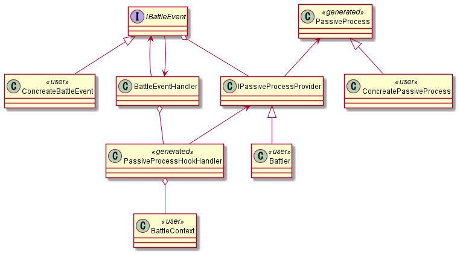
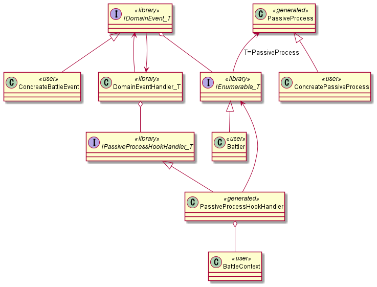

# パッシブ修飾システム

## 生成元

```csharp
[PassiveProcess("BattleContext")]
class PassiveEffectSettings
{
    // ActorAbility内のint, bool, float, stringなどのプリミティブ型が対象
    ActorAbility Ability;

    // 必ずBefore, Afterが両方作られる
    AttackBattleEvent AttackBattleEvent;
    DamageBattleEvent DamageBattleEvent;
}
```

## 概念

* ドメインイベント / DomainEvent
* ドメインコンテキスト / DomainContext
* パッシブ処理 / PassiveProcess
* 補正付きデータ型 / FinalData
* ドメインイベントハンドラー / DomainEventHandler
* パッシブ処理フックハンドラー / PassiveProcessHookHandler

## 生成範囲についての考察

実際に利用している様子のクラス図は以下の通り。



`<<user>>`, `<<generated>>` とついているものはライブラリに含めることはできない。
しかし、他のクラスはライブラリに用意することができるだろうか？

それらのクラスは `user/generated` なクラスに依存しているため、単純ではない。

### IBattleEvent -> IPassiveProcessProvider

`IPassiveProcessProvider` という概念を廃止し、
`IEnumerable<PassiveProcess>` を持てばよいかもしれない。

その場合 `IBattleEvent` はジェネリクス型 `IDomainEvent<T>` となる。
バトル画面以外のドメインでは、
Tの部分にバトル画面以外のためのパッシブ処理が入るので自然かもしれない。

### BattleEventHandler -> PassiveProcessHookHandler

`BattleEventHandler` をジェネリクス型 `DomainEventHandler<T>` として扱い、
`PassiveProcessHookHandler` は新たなインターフェース `IPassiveProcessHookHandler<PassiveProcess>` を実装する形にするとよいかもしれない。

`DomainEventHandler<T>` は `IPassiveProcessHookHandler<T>` に依存するだけとなり、
そういったクラスはライブラリに含めることができる。

### まとめ

以下のような実装にできそう。
ちなみに、 `IEnumerable<T>` は標準ライブラリの型。



型引数 `T` は、そのクラス階層の属するドメインの特徴を記述するものとして考えられる。
例えば、 `BattlePassive` なる名前のクラスは恐らく戦闘ドメインに属するだろう。

library

* IDomainEvent&lt;T>
* DomainEventHandler&lt;T>
* IPassiveProcessHookHandler&lt;T>

user

* BattleContext
* Ability
* ConcretePassiveProcess
* ConcreteBattleEvent
* Battler

generated

* **PassiveProcess**
* Final**Ability**
* **PassiveProcess**HookHandler

## イベント内容の実装

以下のように、イベント内容自体も型にできるかもしれない。

```csharp
using ProcessFunc = IPassiveProcessFunction<PassiveProcess>;

abstract class PassiveProcess
{
    public virtual IEnumerable<ProcessFunc> LeadingProcesses { get; }
    public virtual IEnumerable<ProcessFunc> FollowingProcesses { get; }
    public virtual int ModifyAttack(int source) => source;
    public virtual int ModifyDefence(int source) => source;

    protected PassiveProcessFunction<PassiveProcess, TEvent> Create<TEvent>(
        Func<TEvent, BattleContext, Task> processFunc)
        where TEvent : IBattleEvent<PassiveProcess>
    {
        return new PassiveProcessFunction<PassiveProcess, TEvent>(processFunc);
    }
}

interface IPassiveProcessFunction<TPassive>
{
    Task RunAsync(IBattleEvent<TPassive> @event, BattleContext context);
}

class PassiveProcessFunction<TPassive, TEvent> : IPassiveProcessFunction<TPassive>
    where TEvent : IBattleEvent<TPassive>
{
    private readonly Func<TEvent, BattleContext, Task> _processFunc;

    public PassiveProcessFunction(Func<TEvent, BattleContext, Task> processFunc)
    {
        _processFunc = processFunc;
    }

    public async Task RunAsync(IBattleEvent<TPassive> @event, BattleContext context)
    {
        if (@event is TEvent ev)
        {
            await _processFunc.Invoke(ev, context);
        }
    }
}

class RagePassiveProcess : PassiveProcess
{
    public override IEnumerable<IPassiveProcessFunction<PassiveProcess>> FollowingProcesses { get; }

    public RagePassiveProcess()
    {
        FollowingProcesses = new[]
        {
            Create<DamageEvent>(OnAttackedAsync),
        };
    }

    private async Task OnAttackedAsync(DamageEvent @event, BattleContext context)
    {
        Console.WriteLine("Rage");
    }
}
```

これを用いると、 `PassiveProcessHookHandler` をコード生成でまかなう必然性がなくなる。

`IPassiveProcessFunction<TPassive>`, `PassiveProcessFunction<TPassive, TEvent>` は
なるべくライブラリに含めたいが、 `BattleContext` の存在が懸念点。
ここをライブラリに含められないのならば、
`DomainEventHandler` から直接処理できないため、
`PassiveProcessHookHandler` はまだ必要がある。
`BattleContext` を型引数にするという手があるか。