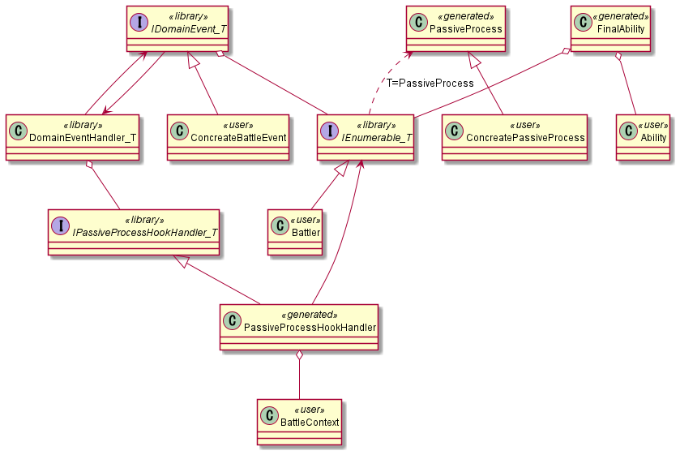

# パッシブ修飾システム

## 生成元

```csharp
[PassiveProcess("BattleContext")]
class PassiveEffectSettings
{
    // ActorAbility内のint, bool, float, stringなどのプリミティブ型が対象
    ActorAbility Ability;

    // 必ずBefore, Afterが両方作られる
    AttackBattleEvent AttackBattleEvent;
    DamageBattleEvent DamageBattleEvent;
}
```

## シンタックス

### 生成元

```bnf
<passive-decorator> ::= <namespace>
<namespace> ::= <namespace-declaration> "{" <class> "}"
<class> ::= <class-declaration>"Settings" "{" <member-list> "}"
<member-list> ::= [<parameter> | <event>]
<parameter> ::= <parameter-type> <parameter-name>
<event> ::= <event-type> <event-name>
```

### 生成先

#### パッシブ修飾クラス

```bnf
<passive-decorator> ::= <namespace>
<namespace> ::= <src.namespace-declaration> "{" <class> "}"
<class> ::= <src.class-declaration> "{" <methods> "}"
<methods> ::= [<hook> | <modifier>]
<hook> ::= "public virtual Task BeforeEventAsync("<src.event-type>" @event) => Task.CompletedTask;" "public virtual Task AfterEventAsync("<src.event-type>" @event) => Task.CompletedTask;"
<modifier> ::= "public virtual int Modify"<src.parameter-member-name>"("<src.parameter-member-type>" source) => source;"
```

#### パッシブフッククラス

```bnf
<passive-hook> ::= <namespace>
<namespace> ::= <src.namespace-declaration> "{" <class> "}"
<class> ::= <src.class-declaration> "{" <methods> "}"
<methods> ::= <before> <after>
<before> ::= "public async Task BeforeEventAsync(IPassiveDecorationProvider provider, IBattleEvent @event)" "{" <before-impl> "}"
```

## 生成範囲についての考察

実際に利用している様子のクラス図は以下の通り。


`<<user>>`, `<<generated>>` とついているものはライブラリに含めることはできない。
しかし、他のクラスはライブラリに用意することができるだろうか？

それらのクラスは `user/generated` なクラスに依存しているため、単純ではない。

### IBattleEvent -> IPassiveProcessProvider

`IPassiveProcessProvider` という概念を廃止し、
`IEnumerable<PassiveProcess>` を持てばよいかもしれない。

その場合 `IBattleEvent` はジェネリクス型 `IDomainEvent<T>` となる。
バトル画面以外のドメインでは、
Tの部分にバトル画面以外のためのパッシブ処理が入るので自然かもしれない。

## BattleEventHandler -> PassiveProcessHookHandler

`BattleEventHandler` をジェネリクス型 `DomainEventHandler<T>` として扱い、
`PassiveProcessHookHandler` は新たなインターフェース `IPassiveProcessHookHandler<PassiveProcess>` を実装する形にするとよいかもしれない。

`DomainEventHandler<T>` は `IPassiveProcessHookHandler<T>` に依存するだけとなり、
そういったクラスはライブラリに含めることができる。

### まとめ

以下のような実装にできそう。

